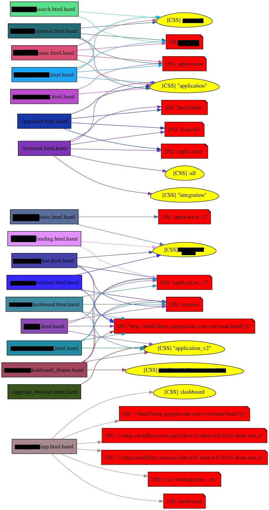

# rails_deps_plot
Quick script w/ graphviz to generate graph of stylesheets/js tags in rails templates, as required by various layouts/views (which views require which assets).
Tune those variables there to suit your needs.

### Tuning

- `:rankdir`: `LR` for vertical graph render, `BT` for horizontal graph
- output format: use `:dot => OUTPUT` (or :xdot) and view it in an interactive GraphViz (http://gephi.org/, https://pypi.python.org/pypi/xdot, ..)
  See list of output formats here: http://www.graphviz.org/doc/info/output.html#d:dot

### Example output

